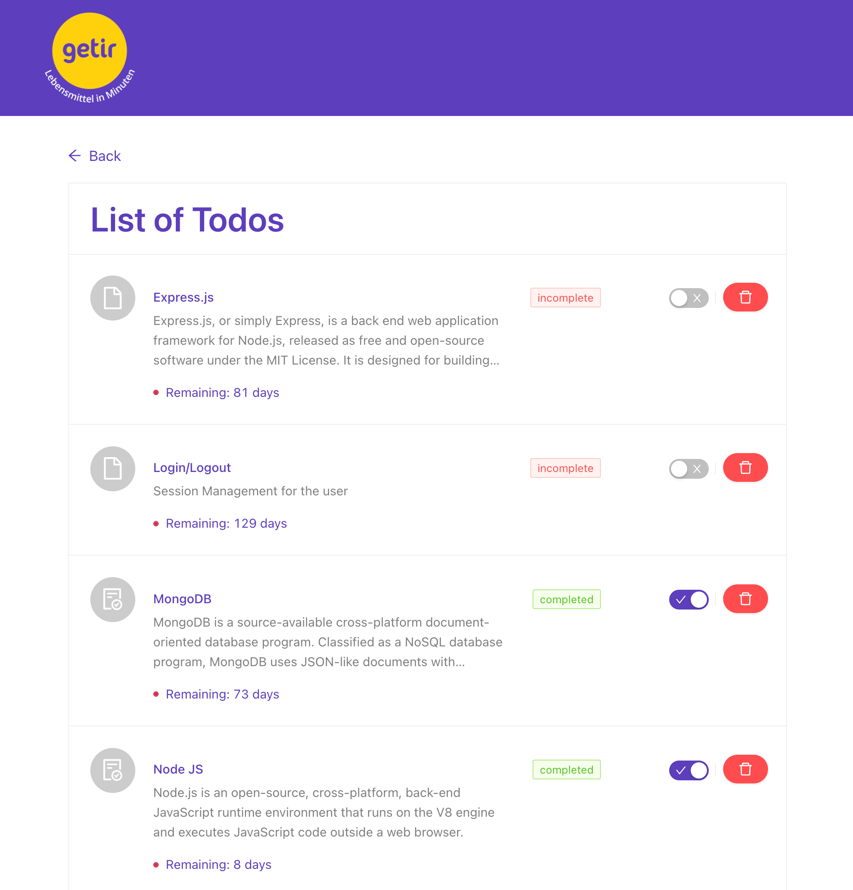
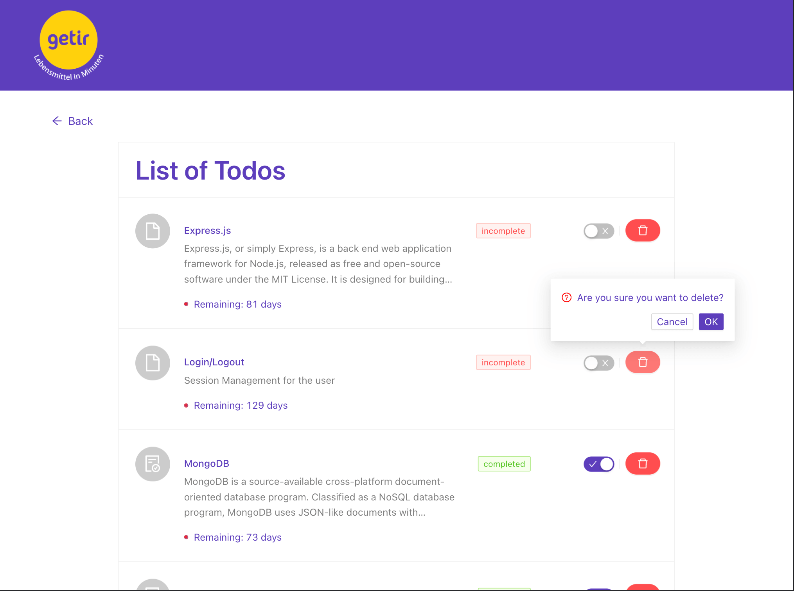

# Todo APP - Getir

Todo Application to manage tasks

<p align="center">
    <a href="https://todo-api-getir.herokuapp.com/" target="blank">Demo</a>
</p>

<p align="center"></p>
<p align="center"></p>
<p align="center"></p>
<p align="center"></p>

<p align="center">
    <a href="https://todo-api-getir.herokuapp.com/" target="blank">API Demo</a>
</p>

<p align="center"></p>

## Technologies

#### Backend

> - [Node.js](https://nodejs.org/)
> - [Express.js](https://expressjs.com/)
> - [Typescript](https://www.typescriptlang.org/)
> - [Mongodb](https://www.mongodb.com/)

#### Frontend

> - [React JS](https://reactjs.org/)
> - [React Router](https://reactrouter.com/)
> - [Redux](https://redux.js.org/)
> - [Redux Toolkit](https://redux-toolkit.js.org/)
> - [Redux Saga](https://redux-saga.js.org/)
> - [Antd UI Library](https://ant.design/)

## Installation Steps

> For detail installation steps please check the sub folders [client](/client/README.md) and [server](/server/README.md) respectively.

> Please before run the app, take into account to have a node.js installed in your system locally and mongodb as well (atleast MongoURI from Atlas)

1. Clone the repository

```bash
git clone https://github.com/ravisankarchinnam/getir-todo-app.git
```

2. Install dependencies

```bash
cd client && yarn install
cd server && yarn install
```

3. Run the app concurrently

```bash
yarn start
```
