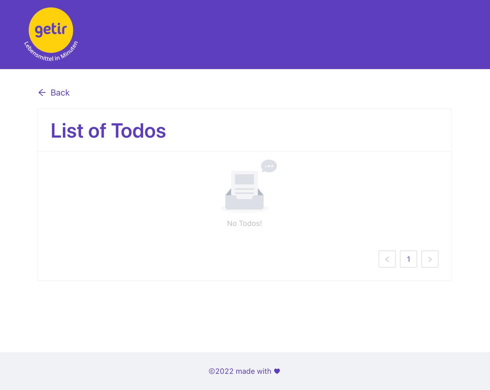

# TODO APP

> This API allows the users to manage their todo list.

<p align="center"></p>

<p align="center"></p>

<p align="center"></p>

<p align="center"></p>

<p align="center">
    <a href="https://todo-app-getir.netlify.app/" target="blank">View Demo</a>
</p>

## Libraries

> - [React JS](https://reactjs.org/)
> - [React Router](https://reactrouter.com/)
> - [Redux](https://redux.js.org/)
> - [Redux Toolkit](https://redux-toolkit.js.org/)
> - [Redux Saga](https://redux-saga.js.org/)
> - [Antd UI Library](https://ant.design/)

## Features

> - Users are able to add a new task to their to-do list
> - Users are able to list thier tasks in the list page
> - Each task has a status tags completed/incomplete
> - Completed Tasks status will be changed to completed
> - Each task contains a deadline for the todo
> - Once the task is completed, user can delete the task
> - Responsive design built using Antd Library

## Installation Steps

> Please before run the app, take into account to have a node.js installed in your system locally

1. Clone the repository

```bash
git clone https://github.com/ravisankarchinnam/getir-todo-app.git
```

2. Change the working directory

```bash
cd client
```

3. Install dependencies

```bash
yarn install
```

4. Create `.env` file in root and add your variables

```bash
REACT_APP_API_URL=YOUR_BACKEND_API_URL
```

5. Run the app

```bash
yarn start
```

> You are all set! Open [localhost:3000](http://localhost:3000/) to see the app.

> `yarn run build` - which generates a build folder with all the files ready for the deployment in the same `client` folder.

## Deployment

> This API is deployed to netlify, please use this link to access the site [https://todo-api-getir.netlify.app](https://todo-app-getir.netlify.app)

## Future Enhancements

1. Create Edit Todo Page
2. Create Login/Register Pages
3. Save Todos per User
4. Send Notifications for expiring todos

## Author

> Ravisankar Chinnam
