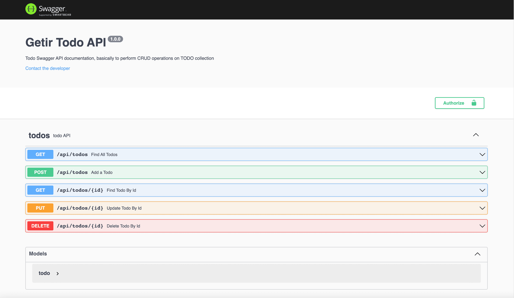

# TODO API

> This API allows users to create, get, update and delete todos.

<p align="center"></p>

<p align="center">
    <a href="https://todo-api-getir.herokuapp.com/" target="blank">View Demo</a>
</p>

## Libraries

> - [Node.js](https://nodejs.org/)
> - [Express.js](https://expressjs.com/)
> - [Typescript](https://www.typescriptlang.org/)
> - [Mongodb](https://www.mongodb.com/)

## Features

> REST API created with node, typescript and mongodb to handle todos
> Endpoints:

> - GET /api/todos -> get all todos
> - GET /api/todos/:id -> get todo by id
> - POST /api/todos -> create a new todo, please provide in the body the values `{name: string, description: string, deadline: date}`
> - PUT /todos/:id -> update a todo with the given id, please provide the updated data described above
> - DELETE /todos/:id -> deletes a todo with the given id

## Installation Steps

> Please before run the app, take into account to have a mongodb where the app can be connected or get ready with mongo atlas URI (to configure it in the .env file)

1. Clone the repository

```bash
git clone https://github.com/ravisankarchinnam/getir-todo-app.git
```

2. Change the working directory

```bash
cd server
```

3. Install dependencies

```bash
yarn install
```

4. Create `.env` file in root and add your variables

```bash
PORT= YOUR_PORT
MONGO_URI= YOUR_MONGO_URI_OR_MONGO_ATLAS_URI
```

5. Run the app

```bash
yarn run dev
```

> You are all set! Open [localhost:3030](http://localhost:3030/) to see the app.

> `yarn run prod` - which generates a dist folder with all the files ready for the deployment in the same `server` folder.

## Deployment

> This API is deployed to heroku along with Swagger API Documentation, please use this endpoint [https://todo-api-getir.herokuapp.com](https://todo-api-getir.herokuapp.com)

## Future Enhancements

1. Create Login/Register API
2. Implement Session management
3. Save Todos per User
4. Send Notifications for expiring todos

## Author

> Ravisankar Chinnam
